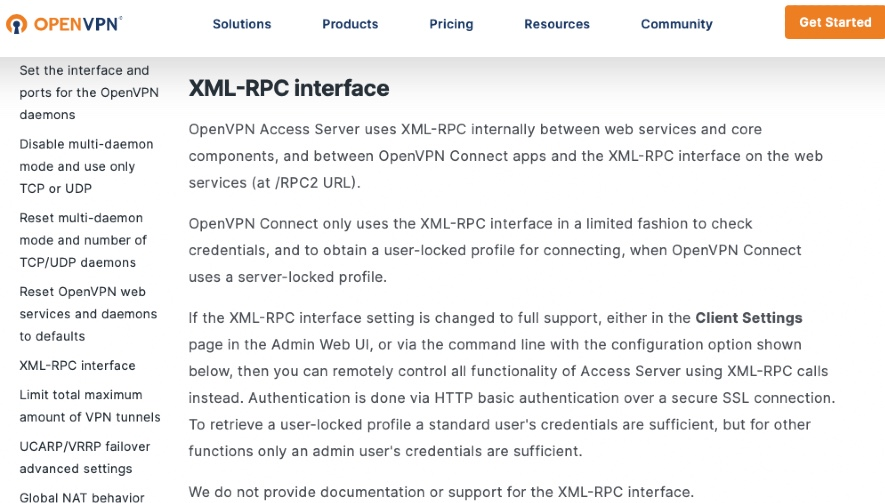

# OpenSesame
OpenSesame is a python tool for running commands against the OpenVPN_AS XML-RPC API

# Who is this tool for?
- Red Teamers
- Penetration Testers
- OpenVPN Access Server administrators that want to use the "Purposely Undocumented" XML-RPC API

# Why was this tool created?
On a red team engagement for a customer we found they were using on-prem OpenVPN-AS for their employee VPN system.  In poking around at the endpoint we found XML-RPC API was enabled and decided to try using that to create arbitrary users for us to connect as, as we had admin user credentials for OVPN but did not have any end user accounts that we could set up for use with the MFA system they had enabled.  

After finding out that OpenVPN purposely does not document the XML-RPC API (see image 1 below!) 

It should be noted that the XML-RPC API has all of the same functionality of the `sacli` command that ships with OpenVPN-AS, we decided it was time to write a tool that can execute some of the more useful commands from an attacker perspective, and thus OpenSesame was born!
